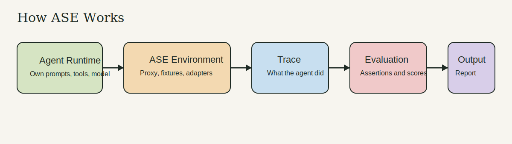
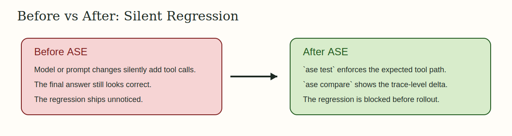

# ASE

ASE is the open pre-production testing and certification layer for agent systems.

ASE helps teams observe what an agent **did**, not just what it **said**:

- `ase watch` shows live tool calls with zero-config proxy interception
- `ase test` runs scenarios and assertions against agent behavior
- `ase compare` shows what changed between two runs after a model or prompt update

## Install

```bash
pip install ase-python
```

## Why ASE Exists

- Agents break through actions: API calls, database mutations, emails, and side effects
- Prompt or model changes can silently alter tool usage without obvious output regressions
- Teams need deterministic pre-production checks before rollout, not just production tracing
- Framework-neutral traces and certifications make regression testing portable across stacks

## The Three-Command Product Story

```bash
ase watch
ase test examples/customer-support/scenarios/refund-happy-path.yaml
ase compare /tmp/baseline.trace.json /tmp/candidate.trace.json
```

## 5-Minute Quickstart

```bash
python3.11 -m venv .venv
source .venv/bin/activate
export PIP_CONSTRAINT=constraints/py311.txt
python -m pip install --upgrade pip
pip install -e ".[dev]"

ase test examples/customer-support/scenarios/refund-happy-path.yaml
ase test examples/instrumented-python/scenario.yaml
```

For the full setup guide, see [docs/setup.md](docs/setup.md).

## How ASE Works



ASE keeps the agent's own prompts, model, and reasoning intact. It provides
the environment, captures the trace, evaluates the run, and reports what
happened.

More diagrams:

- [How ASE Works](docs/how-ase-works.md)
- [Neutral Core Boundaries](docs/architecture-boundaries.md)

## Real Framework Validation

ASE includes lightweight upstream validation harnesses for:

- OpenAI Agents Python
- LangGraph Python
- PydanticAI Python
- OpenAI Agents JS

Fetch and bootstrap one upstream validation workspace on demand:

```bash
python scripts/bootstrap_upstream_validations.py --framework openai-agents-python
ase test validation/upstream/openai-agents-python/ase-scenario.yaml
ase certify validation/upstream/openai-agents-python/ase-manifest.yaml
```

The repo does not ship vendored upstream framework clones. The bootstrap script
materializes them into `.upstream/`, which is intentionally ignored.

## Before vs After ASE



ASE matters when behavior changes are silent:

- without ASE: a prompt/model change ships with extra tool calls or unexpected mutations
- with ASE: `ase test` and `ase compare` flag the behavior change before deployment

See the full proof set:

- [Why ASE Is Critical](docs/why-ase-is-critical.md)
- [Reproducible Case Studies](docs/case-studies/README.md)
- [Compatibility Matrix](docs/compatibility-matrix.md)

## Docs

- [Documentation Index](docs/README.md)
- [Example Workflows](docs/example-workflows.md)
- [Build an Adapter](docs/build-an-adapter.md)
- [CI/CD Guide](docs/ci-cd.md)
- [Release Guide](docs/releasing.md)
- [Contributing](CONTRIBUTING.md)
- [Security Policy](SECURITY.md)
