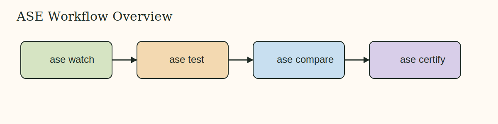
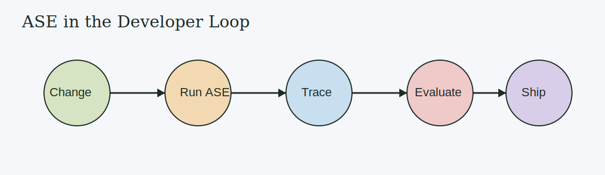
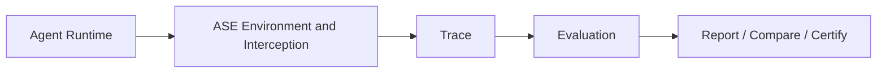
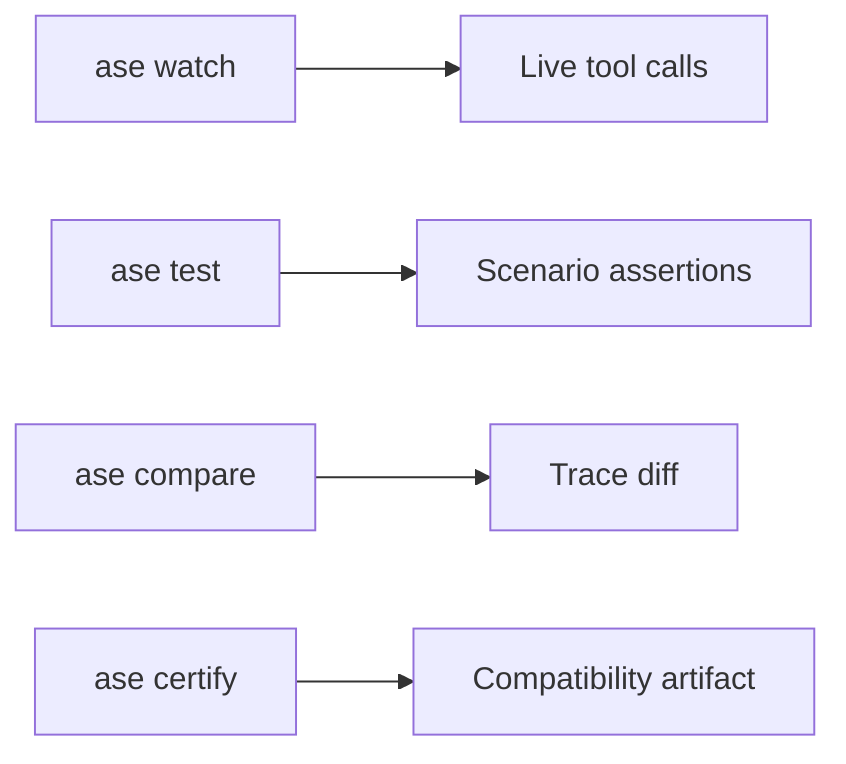
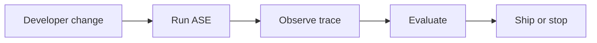

# How ASE Works

## Mermaid Source

```mermaid
flowchart LR
    A["Agent Runtime"] --> B["ASE Environment and Interception"]
    B --> C["Trace"]
    C --> D["Evaluation"]
    D --> E["Report / Compare / Certify"]
```

```mermaid
flowchart LR
    W["ase watch"] --> T["Live tool calls"]
    X["ase test"] --> Y["Scenario assertions"]
    C["ase compare"] --> Z["Trace diff"]
    F["ase certify"] --> G["Compatibility artifact"]
```

```mermaid
flowchart LR
    D["Developer change"] --> R["Run ASE"]
    R --> O["Observe trace"]
    O --> E["Evaluate"]
    E --> S["Ship or stop"]
```

