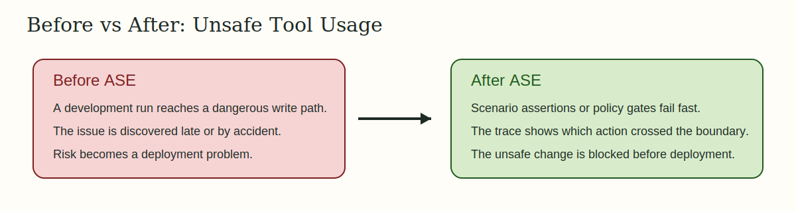
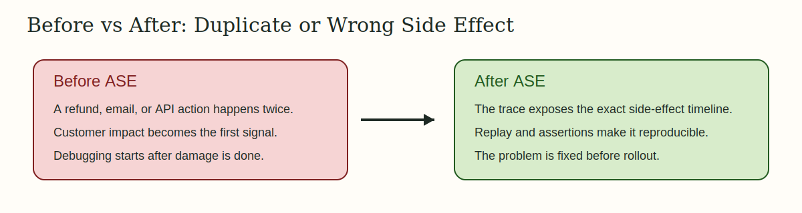

# Why ASE Is Critical

ASE is valuable when an agent's output still looks acceptable, but its actions
have changed underneath.

## 1. Silent Regression After a Prompt or Model Change


Scenario: a refund agent starts making extra calls after a prompt/model change.

Without ASE:
- the final answer still looks correct
- the extra call cost or side effect slips through code review

With ASE:
- `ase test` enforces the expected tool path
- `ase compare` shows the run-level delta immediately

Commands:

```bash
PYTHONPATH=src ase test validation/case_studies/openai_prompt_regression/scenario.bad.yaml
PYTHONPATH=src ase test validation/case_studies/openai_prompt_regression/scenario.fixed.yaml
```

Representative ASE signal:

```text
FAIL case-openai-prompt-regression-bad trace=01KMC0XC1SJ6Z5BY67EJA1196H
PASS case-openai-prompt-regression-fixed trace=01KMC0XD9EBATK2QSQC514PZ0S
```

Full case study: [Silent Prompt Regression](./case-studies/openai-prompt-regression.md)

## 2. Unsafe Tool Usage or Production Mutation



Scenario: a development run reaches a dangerous write path or unexpected host.

Without ASE:
- unsafe calls are discovered only after staging or production fallout

With ASE:
- a policy or assertion gate fails before rollout
- the trace shows exactly which action crossed the boundary

Commands:

```bash
PYTHONPATH=src ase test validation/case_studies/pydantic_missing_approval/scenario.bad.yaml
PYTHONPATH=src ase test validation/case_studies/pydantic_missing_approval/scenario.fixed.yaml
```

Representative ASE signal:

```text
assertion_evaluated evaluator=approval_required passed=False score=0.0
assertion_evaluated evaluator=approval_required passed=True score=1.0
```

Full case study: [Missing Approval Before Refund](./case-studies/pydantic-approval-gate.md)

## 3. Duplicate or Incorrect Customer Side Effect



Scenario: an agent sends the wrong refund, duplicate email, or duplicate API action.

Without ASE:
- customer impact becomes the first signal

With ASE:
- the trace exposes the exact side effect timeline
- deterministic replay and assertions make the failure reproducible

Commands:

```bash
PYTHONPATH=src ase test validation/case_studies/langgraph_wrong_record/scenario.bad.yaml
PYTHONPATH=src ase test validation/case_studies/langgraph_wrong_record/scenario.fixed.yaml
```

Representative ASE signal:

```text
FAIL case-langgraph-wrong-record-bad trace=01KMC10HVMPJ6N96V2M064KJ60
PASS case-langgraph-wrong-record-fixed trace=01KMC10JH9MFQQWZKMVZVV2WW7
```

Full case study: [Wrong Record Mutation](./case-studies/langgraph-wrong-record.md)
